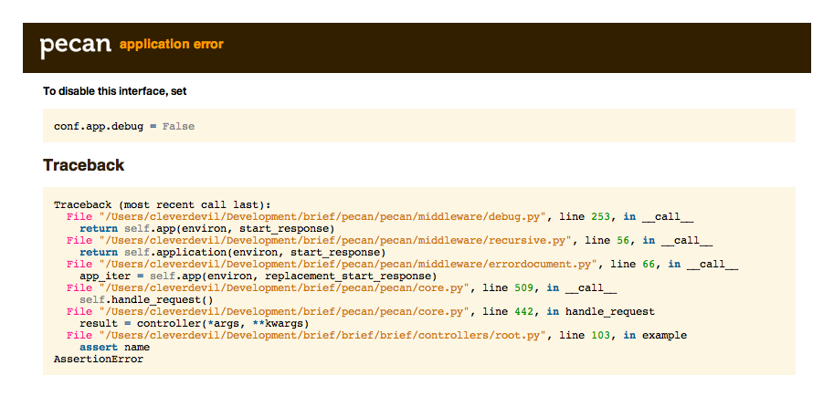
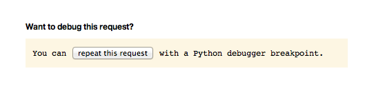

.. _development:

Developing Pecan Applications Locally
=====================================

.. include:: reload.rst
    :start-after: #reload

Debugging Pecan Applications
----------------------------

Pecan comes with simple debugging middleware for helping diagnose problems 
in your applications. To enable the debugging middleware, simply set the
``debug`` flag to ``True`` in your configuration file::

    app = {
        ...
        'debug': True,
        ...
    }

Once enabled, the middleware will automatically catch exceptions raised by your
application and display the Python stack trace and WSGI environment in your 
browser for easy debugging:

To further aid in debugging, the middleware includes the ability to repeat the
offending request, automatically inserting a breakpoint, and dropping your
console into the Python debugger, ``pdb``:

.. seealso::

  Refer to the `pdb documentation
  <http://docs.python.org/library/pdb.html>`_ for more information on
  using the Python debugger.

Serving Static Files
--------------------

Pecan comes with simple file serving middleware for serving CSS, Javascript,
images, and other static files.  You can configure it by ensuring that the 
following options are specified in your configuration file:

::

    app = {
        ...
        'debug': True,
        'static_root': '%(confdir)/public
    }

where ``static_root`` is an absolute pathname to the directory in which your
static files live.  For convenience, the path may include the ``%(confdir)``
variable, which Pecan will substitute with the absolute path of your
configuration file at runtime.

.. note::

    In production, ``app.debug`` should *never* be set to ``True``, so you'll
    need to serve your static files via your production web server.
